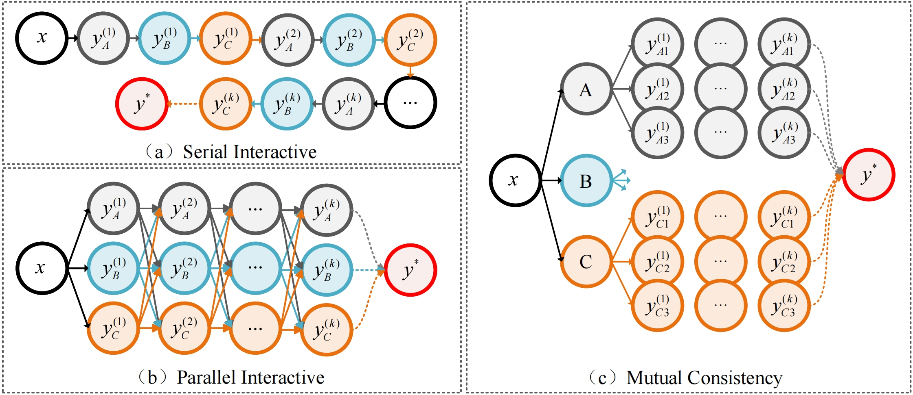
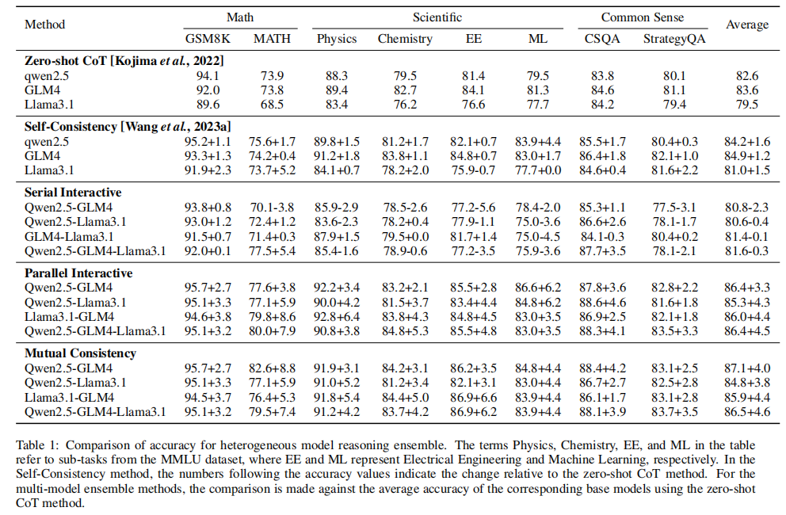

# HLLMensembles
# Can Cross-Model Ensemble of Heterogeneous Large Language Models Enhance Reasoning Capabilities？

This is the official implementation of `Can Cross-Model Ensemble of Heterogeneous Large Language Models Enhance Reasoning Capabilities？` 

<div align="center">

</div>

Figure 1 Distinct ensemble frameworks for heterogeneous large language models based on dynamic interaction mechanisms. (a) Serial Interactive. Multiple HLLMs are connected in a specific sequence, with the models reasoning step by step and gradually reaching a consensus. (b)Parallel Interactive. Multiple HLLMs are interconnected in a parallel, reasoning simultaneously and interactively optimizing the results. (c) Mutual Consistency. Multiple HLLMs reason independently and determine the final answer through a mutual consistency mechanism.


## Result
<div align="center">

</div>


## Installation
Make sure you have Python=3.8, torch=2.3, and openai=1.26 installed on your machine.


## Set your OpenAI API key
```
The API key for the large language model you choose to use can be obtained from the official website, such as:
Qwen:https://www.aliyun.com/product/bailian
GLM4:https://open.bigmodel.cn/
Llama:https://www.llama-api.com/
```

## Quick Start

### Serial Interactive 
```
python Serial_Interactive.py --dataset (dataset name) --output_dir (Output result path)
```

### Parallel Interactive
```
python Parallel_Interactive.py --dataset (dataset name) --output_dir (Output result path)
```

### Mutual Consistency
```
python Mutual_Consistency.py --dataset (dataset name) --output_dir (Output result path)
```


